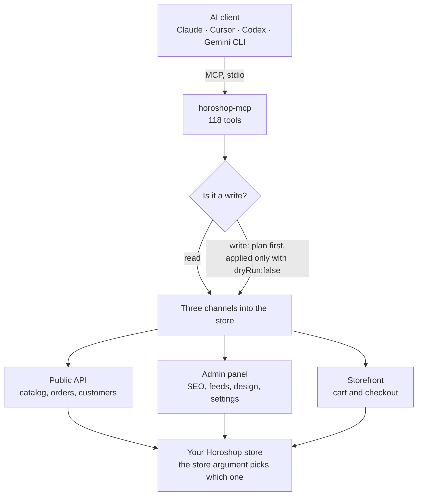

# Horoshop MCP: unofficial MCP server for Horoshop stores

[Українська](README.md) · [Русский](README.ru.md) · **English**

[](https://github.com/IgorShutko/horoshop-mcp/actions/workflows/ci.yml)
[](LICENSE)
[](https://nodejs.org/)
[](https://modelcontextprotocol.io/)
[](docs/TOOLS.md)
[](https://registry.modelcontextprotocol.io/v0/servers?search=horoshop)

**Horoshop MCP** (`horoshop-mcp`) is a free, open-source [MCP](https://modelcontextprotocol.io/) server that connects AI agents such as Claude, Cursor, Codex and Hermes Agent to online stores built on [Horoshop](https://horoshop.ua/), the Ukrainian e-commerce platform. It runs on your computer, works with several stores at once and gives the agent 118 tools for the catalog, orders, SEO, redirects, marketplace feeds, design and store settings.

> **Unofficial project.** Horoshop MCP is not made, endorsed or supported by Horoshop. The admin-panel tools use internal, undocumented endpoints of the control panel, which Horoshop may change without notice. Try new workflows on a test store before running them on a live one.

- **118 tools** across three layers: the public Horoshop API, the control panel behind it, and the storefront cart.
- **Many stores, one server.** Every tool takes a `store` argument, so an agency can work with all client shops through a single connection.
- **Safe by default.** 57 of the 71 write tools only preview their changes until you pass `dryRun:false`; risky bulk operations demand explicit confirmations; writes are verified by reading the result back.
- **Local.** The server runs on your machine over stdio. Credentials stay in a file you control.

## Contents

- [Quick start](#quick-start)
- [What it can do](#what-it-can-do)
- [Configuration](#configuration)
- [How writes are protected](#how-writes-are-protected)
- [Known limitations](#known-limitations)
- [Security](#security)
- [How it works](#how-it-works)
- [FAQ](#faq)
- [Development](#development)
- [Author and contacts](#author-and-contacts)
- [License](#license)

Project page: [igorshutko.github.io/horoshop-mcp](https://igorshutko.github.io/horoshop-mcp/en/)

Documentation: [docs/INSTALL.md](docs/INSTALL.md) (setup for 22 clients) · [docs/TOOLS.md](docs/TOOLS.md) (every tool and parameter) · [docs/INTERNALS.md](docs/INTERNALS.md) (architecture and platform notes).

## Quick start

**1. Requirements.** Node.js 18 or newer and Git.

**2. Credentials.** Create an admin user in your store's control panel (**Settings → Admins → Add**) and note its login and password. The same pair works for the API and for the admin-panel tools. Details: [Get Horoshop credentials](docs/INSTALL.md#1-get-horoshop-credentials).

**3. stores.json.** Save it somewhere private:

```json
{
  "myshop": { "baseUrl": "https://myshop.com.ua", "login": "api-user", "password": "REPLACE_ME" }
}
```

**4. Connect your client.** No clone needed.

*Claude Desktop, the easy path:* download `horoshop-mcp.mcpb` from the [latest release](https://github.com/IgorShutko/horoshop-mcp/releases/latest) and open it. Claude Desktop installs the server itself and asks where your `stores.json` lives. No terminal.

*Every other client* starts the server with `npx`.

Claude Code:

```bash
claude mcp add horoshop -s user -e HOROSHOP_STORES_FILE=/abs/path/to/stores.json -- npx -y github:IgorShutko/horoshop-mcp
```

Codex:

```bash
codex mcp add horoshop --env HOROSHOP_STORES_FILE=/abs/path/to/stores.json -- npx -y github:IgorShutko/horoshop-mcp
```

Cursor (`~/.cursor/mcp.json`), Claude Desktop (`claude_desktop_config.json`), Windsurf, LM Studio, Kiro and most other clients:

```json
{
  "mcpServers": {
    "horoshop": {
      "command": "npx",
      "args": ["-y", "github:IgorShutko/horoshop-mcp"],
      "env": { "HOROSHOP_STORES_FILE": "/abs/path/to/stores.json" }
    }
  }
}
```

To pin a version, append the tag: `github:IgorShutko/horoshop-mcp#v0.2.0`.

On Windows use `"command": "cmd", "args": ["/c", "npx", "-y", "github:IgorShutko/horoshop-mcp"]`. The first start downloads and builds the package, which takes about 20 seconds. VS Code, Zed, Hermes Agent, Gemini CLI, OpenCode, Goose and the rest have their own formats: see [docs/INSTALL.md](docs/INSTALL.md), which also covers a regular clone-and-build install and client timeouts.

**5. Try it.** Ask your agent:

- *"List my Horoshop stores and check that authentication works."*
- *"Show the 10 newest orders in myshop with status and total."*
- *"Which products in myshop are out of stock? Show article, title and price."*
- *"Set the SEO title and description of the /shoes/ category in Ukrainian and Russian. Preview only."*
- *"Create 301 redirects from this list of old URLs. Dry run first."*

## What it can do

| Area | Tools | Examples |
|---|---|---|
| Setup and diagnostics | 2 | list configured stores, check API authentication |
| Catalog (public API) | 4 | export and import products, attach images, list stickers |
| Orders (public API) | 3 | read orders with UTM and delivery data, update status and payment, list statuses |
| Categories, users, product sets | 5 | category tree, export and import customers, "bought together" sets |
| Payment, delivery, currency | 5 | payment and delivery options, exchange rates |
| B2B and webhooks | 4 | customer groups, price levels, event subscriptions |
| Storefront | 6 | drive a real buyer cart, apply a coupon, inspect what checkout offers |
| Admin: generic engine | 6 | read, save or delete any record of any control-panel entity |
| Admin: orders and analytics | 8 | read and edit orders, cancel or delete them, resolve order numbers, print waybills, sales dashboard |
| Admin: products, prices, images | 9 | bulk price changes with rollback, group edits and merges, warehouse stock, supplier price-list import, image import by file name |
| Admin: characteristics and dictionaries | 15 | category characteristic schemas, product templates, attribute dictionaries and their translations |
| Admin: categories, pages, blog, banners, filters | 12 | categories and info pages with SEO texts, blog articles, banners, indexable filter landings |
| Admin: SEO, sitemap, redirects | 11 | pagination canonical and noindex settings, robots.txt, sitemap, 301 redirects with loop and duplicate checks |
| Admin: marketplace feeds | 6 | Rozetka, Hotline, Google, Facebook and Kasta feeds: switch, map, regenerate, verify |
| Admin: design and localization | 8 | theme settings, custom CSS, languages, interface translations |
| Admin: store settings, marketing, fiscal receipts | 14 | contacts and store info, checkout options, tracking codes (GTM, Pixel, GA4), coupons, Checkbox receipts |

Every tool, its access level and all parameters: [docs/TOOLS.md](docs/TOOLS.md). Agents are better served by [`docs/tools.json`](docs/tools.json): the same list without the prose, one compact record per tool.

## Configuration

The server reads everything from environment variables.

| Variable | Default | Purpose |
|---|---|---|
| `HOROSHOP_STORES_FILE` | none | Path to the stores JSON file (recommended). |
| `HOROSHOP_STORES` | none | The same JSON inline. Takes priority over the file. |
| `HOROSHOP_DEFAULT_STORE` | the only store, if there is one | Store used when a call omits `store`. |
| `HOROSHOP_TIMEOUT_MS` | `120000` | Timeout for one HTTP request to a store. |
| `HOROSHOP_MAX_RESPONSE_BYTES` | `100000` | Read answers larger than this are held back with a hint on how to narrow them. `HOROSHOP_EXPORT_MAX_BYTES` is accepted as an alias. |
| `HOROSHOP_WIDGET_RETRY` | on | `off` disables the automatic retry of idempotent control-panel widget writes (see [Known limitations](#known-limitations)). |
| `HOROSHOP_GRID_REPAIR_MAX` | computed per list, at most 60 | Extra page reads allowed when a long admin list shifts while being read. |
| `HOROSHOP_IMPORT_POST_LIMIT` | `120000` | Maximum bytes per `catalog/import` request; bigger imports are split automatically. |

Stores file format:

```json
{
  "myshop": { "baseUrl": "https://myshop.com.ua", "login": "api-user", "password": "REPLACE_ME" },
  "othershop": { "baseUrl": "othershop.ua", "login": "api-user", "password": "REPLACE_ME" }
}
```

The key is the name used as `store`. `baseUrl` may be a bare domain and may end with a slash or `/api`. A missing configuration is not fatal: the server still starts and lists its tools, and calls explain what is missing. A malformed file stops the server with a clear message.

## How writes are protected

- **Preview first.** 57 of the 71 write tools run with `dryRun` on by default and return a plan: what will change, from what, to what. Nothing is written until you repeat the call with `dryRun:false`.
- **Confirmations for irreversible or bulk actions.** Deleting or cancelling orders, deleting dictionaries, changing a feed alias (it is the public feed URL) and running a price import each need an explicit `confirm`. `horoshop_admin_products_price_set` refuses zero or negative prices, requires the exact product count above 50 products and an acknowledgement for changes above 50%, and returns a ready rollback payload.
- **Read-back verification.** Writers re-read what they wrote, often through a second channel (for example, an admin-panel write checked through the public API), because Horoshop sometimes answers `OK` without saving anything.
- **Template guard.** Storefront texts often contain placeholders like `{DISCOUNT_PERCENT}` or `{site}`. Writers refuse to replace them with plain text unless you pass `allowPlaceholderLoss:true`.
- **Size gate.** Read tools measure their answer and hold back anything over 100 KB with a precise hint, so one call cannot flood the conversation.
- **Secrets stay hidden.** `horoshop_admin_design_get` withholds the payment section and masks key-like values; `horoshop_list_stores` never returns credentials.
- **Tool annotations.** Every tool is marked read-only, write or destructive, so clients that support it can auto-approve reads and ask before writes.

## Known limitations

These come from the platform, not from the server, and were measured on live stores:

- **Import, no delete, in the public API.** Products and users can be created or updated but not deleted through `/api/`; categories are read-only there. The admin-panel tools cover deletion and category editing.
- **Catalog export returns at most 500 products per call,** whatever `limit` says. Page through with `offset` and `limit` (100 per page works well).
- **Order line items cannot be edited,** neither through the API nor through the control panel. Recipient, address, payment and manager comment can.
- **Single photos cannot be removed from a gallery.** Horoshop exposes no route for it.
- **Control-panel widget writes are occasionally lost.** During bursts some requests reach the storefront instead of the admin and nothing is saved. Idempotent writes (update, delete) are retried up to five times and misses are reported; creation is never retried, to avoid duplicates.
- **Opening an order in the control panel moves it to the top of the admin order list** (the platform stamps the row's date). Order data is not changed; the tools open editors as rarely as possible.
- **The analytics dashboard covers a fixed period.** For arbitrary date ranges aggregate `horoshop_orders_get`.
- **Some sections exist only when the store has the module,** for example the custom CSS editor. `horoshop_admin_css_get` then reports `available:false` instead of an empty result.

The full list with details is in [docs/INTERNALS.md](docs/INTERNALS.md#platform-notes).

## Security

- Keep credentials in the stores file or environment variables, never in prompts or tool arguments. `stores*.json`, backups and `.env` files are git-ignored.
- Create a dedicated admin user for the server and give it the narrowest role that fits your work. Remove it to revoke access.
- The server talks only to the stores you configure, to the Horoshop image-upload service that your control panel points to during image imports, and to image URLs you ask it to upload. There is no telemetry.
- API tokens and control-panel sessions live in memory only.
- When reporting a bug, do not paste real store data, order details or credentials into the issue.
- The security model, what gets masked in responses and where to report a vulnerability: [SECURITY.md](SECURITY.md).

## How it works

The server combines three channels to a store:



1. **Public API** (`/api/<function>/`): token authentication, cached per store and renewed transparently. Used for catalog, orders, users, reference data, B2B and webhooks.
2. **Control panel**: a session from `/core-api/admin/security/login`, then the legacy admin screens. The admin is a uniform machine keyed on `handler` (entity type): lists, edit forms, save endpoints. A registry of these entity types lets a small generic core reach almost every section, with named tools for the common ones. Writes read the whole form, change only the requested fields and replay the rest, so untouched fields are preserved.
3. **Storefront**: the shop's own cart widget (`/_widget/ajax_cart/`), for questions the API cannot answer, such as whether a buyer can actually reach checkout with a given delivery option.

Architecture, project layout and platform notes: [docs/INTERNALS.md](docs/INTERNALS.md).

## FAQ

### What is Horoshop MCP?

Horoshop MCP is an open-source server that implements the Model Context Protocol for the Horoshop e-commerce platform. An AI agent connected to it can read and change a Horoshop store through 118 tools: products, orders, customers, categories, SEO texts, 301 redirects, marketplace feeds, design and settings. The server runs locally and can serve several stores at once.

### Is Horoshop MCP an official Horoshop product?

No. Horoshop MCP is an independent open-source project and is not affiliated with Horoshop. It uses the public Horoshop API and, for everything the API does not cover, the same control-panel requests that the admin interface makes. Those internal requests can change at any time, so test new workflows on a separate store.

### Which AI assistants work with Horoshop MCP?

Any MCP client that can start a local stdio server. [docs/INSTALL.md](docs/INSTALL.md) has step-by-step setup for 22 clients, including Claude Code, Claude Desktop, Cursor, OpenAI Codex, Hermes Agent, VS Code with GitHub Copilot, Windsurf, Gemini CLI, Zed and Cline.

### What do I need to connect my store?

Node.js 18 or newer, Git, and the login and password of an admin user of your Horoshop store. Put the credentials into `stores.json`, add the server to your AI client with one command, and wait about 20 seconds for the first start to build the package.

### Is it safe to give an AI agent access to my store?

The server is designed for it. 57 of the 71 write tools only show a plan until you pass `dryRun:false`, irreversible actions need an explicit `confirm`, and every write is checked by reading the result back. Credentials stay in a local file, and the server sends no telemetry. Give the server a dedicated admin user with the narrowest role that fits.

### Can one server manage several stores?

Yes. List every store in one `stores.json` file, and each call picks a store with the `store` argument. An agency can work with all client shops through one connection.

### How much does Horoshop MCP cost?

Horoshop MCP is free and released under the MIT license. You only pay for your Horoshop plan and for the AI client you use.

## Development

```bash
git clone https://github.com/IgorShutko/horoshop-mcp.git
cd horoshop-mcp
npm install          # installs dependencies and builds dist/
npm run watch        # recompile on change
npm run inspect      # build and open the MCP Inspector
npm run docs:tools   # regenerate docs/TOOLS.md from the running server
```

MCP clients start the server once, so restart your client after rebuilding. `horoshop_check_auth` and `horoshop_list_stores` report `stale:true` when the build on disk is newer than the running process.

`evaluation/horoshop_eval.xml` holds a set of read-only questions for checking that a model can complete real tasks through the server. The answers depend on the connected store, so fill them in against your own test store.

`npm test` boots the built server and checks what every client depends on: all 118 tools present, the stdout channel clean, every tool routable to a store. CI runs the same commands on Node 18 and 22.

Issues and pull requests are welcome: [CONTRIBUTING.md](CONTRIBUTING.md) for the rules, [AGENTS.md](AGENTS.md) for AI agents changing this code, [CHANGELOG.md](CHANGELOG.md) for what changed between versions. Keep real store data out of issues, logs and test fixtures.

## Author and contacts

Horoshop MCP is built and maintained by Igor Shutko, [Target+](https://www.targetplus-agency.com/) agency.

- Telegram: [@shutko_igor](https://t.me/shutko_igor)
- Telegram channel: [@shutko_ads](https://t.me/shutko_ads)

Bugs and feature requests: [GitHub Issues](https://github.com/IgorShutko/horoshop-mcp/issues).

## License

[MIT](LICENSE).
