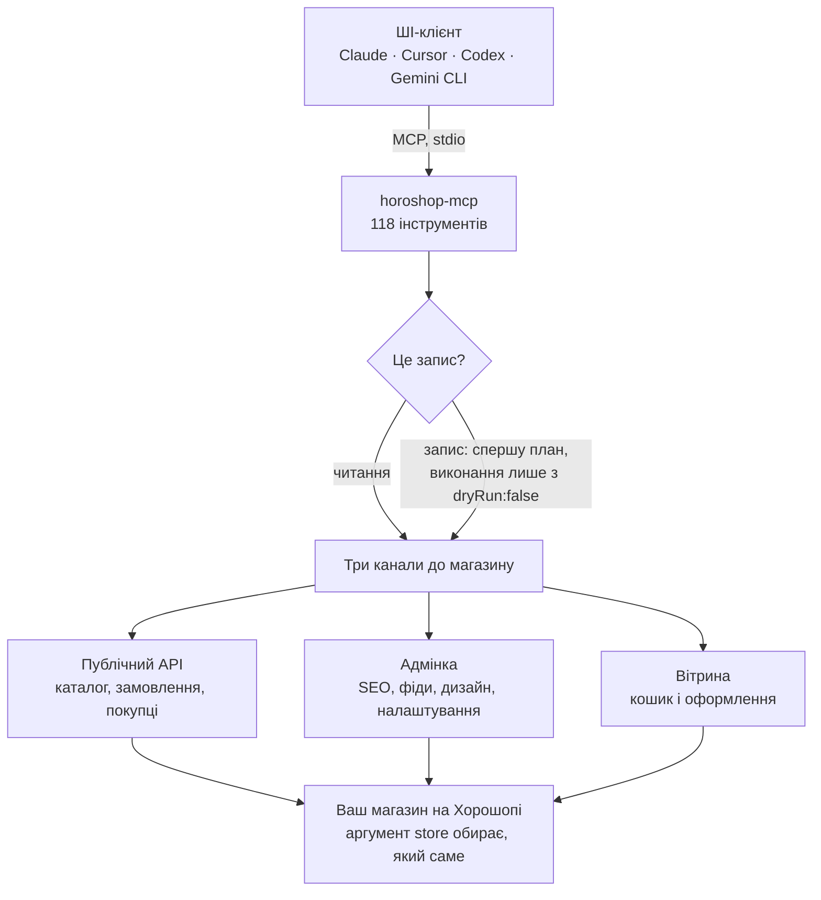

# Хорошоп MCP: неофіційний MCP-сервер для магазинів на Хорошопі

**Українська** · [Русский](README.ru.md) · [English](README.en.md)

[](https://github.com/IgorShutko/horoshop-mcp/actions/workflows/ci.yml)
[](LICENSE)
[](https://nodejs.org/)
[](https://modelcontextprotocol.io/)
[](docs/TOOLS.md)

**Хорошоп MCP** (`horoshop-mcp`): безкоштовний [MCP](https://modelcontextprotocol.io/)-сервер з відкритим кодом, який підключає ШІ-агентів Claude, Cursor, Codex, Hermes Agent та інших до інтернет-магазину на платформі [Хорошоп](https://horoshop.ua/). Сервер працює на вашому комп'ютері, обслуговує кілька магазинів одночасно і дає агенту 118 інструментів для каталогу, замовлень, SEO, редиректів, фідів маркетплейсів, дизайну та налаштувань магазину.

> **Неофіційний проєкт.** Хорошоп MCP не є продуктом компанії Хорошоп, не пов'язаний з нею і нею не підтримується. Інструменти адмінки працюють через внутрішні недокументовані запити, які Хорошоп може змінити без попередження. Нові сценарії спершу перевіряйте на тестовому магазині і лише потім запускайте на робочому.

- **118 інструментів** на трьох рівнях: публічний API Хорошопу, адмінка та кошик вітрини.
- **Багато магазинів, один сервер.** Кожен інструмент приймає аргумент `store`, тож агенція може працювати з магазинами всіх клієнтів через одне підключення.
- **Безпечно за замовчуванням.** 57 з 71 інструмента запису лише показують план змін, доки ви не передасте `dryRun:false`; ризиковані масові операції вимагають явного підтвердження; кожен запис перевіряється повторним читанням результату.
- **Локально.** Сервер працює на вашому комп'ютері через stdio. Доступи лежать у файлі, який контролюєте ви.

## Зміст

- [Швидкий старт](#швидкий-старт)
- [Можливості](#можливості)
- [Налаштування](#налаштування)
- [Захист від помилкових змін](#захист-від-помилкових-змін)
- [Обмеження платформи](#обмеження-платформи)
- [Безпека](#безпека)
- [Як це працює](#як-це-працює)
- [Часті запитання](#часті-запитання)
- [Розробка](#розробка)
- [Автор і контакти](#автор-і-контакти)
- [Ліцензія](#ліцензія)

Документація: [інструкція з встановлення](docs/INSTALL.uk.md) для 22 клієнтів · [довідник інструментів](docs/TOOLS.md) з усіма параметрами (англійською) · [внутрішній устрій](docs/INTERNALS.md) та особливості платформи (англійською).

## Швидкий старт

**1. Що потрібно.** Node.js 18 або новіший і Git.

**2. Доступи.** Створіть в адмінці магазину окремого адміністратора (у російському інтерфейсі розділ «Настройки → Админы», кнопка «Добавить») і збережіть його логін і пароль. Та сама пара працює і для API, і для інструментів адмінки. Детальніше: [як отримати доступи Хорошопу](docs/INSTALL.uk.md#1-отримайте-доступи-хорошопу).

**3. stores.json.** Збережіть файл у місці, куди не мають доступу сторонні:

```json
{
  "myshop": { "baseUrl": "https://myshop.com.ua", "login": "api-user", "password": "REPLACE_ME" }
}
```

**4. Підключіть ШІ-клієнт.** Клонувати репозиторій не потрібно: клієнт сам запускає сервер через `npx`.

Claude Code:

```bash
claude mcp add horoshop -s user -e HOROSHOP_STORES_FILE=/abs/path/to/stores.json -- npx -y github:IgorShutko/horoshop-mcp
```

Codex:

```bash
codex mcp add horoshop --env HOROSHOP_STORES_FILE=/abs/path/to/stores.json -- npx -y github:IgorShutko/horoshop-mcp
```

Cursor (`~/.cursor/mcp.json`), Claude Desktop (`claude_desktop_config.json`), Windsurf, LM Studio, Kiro і більшість інших клієнтів:

```json
{
  "mcpServers": {
    "horoshop": {
      "command": "npx",
      "args": ["-y", "github:IgorShutko/horoshop-mcp"],
      "env": { "HOROSHOP_STORES_FILE": "/abs/path/to/stores.json" }
    }
  }
}
```

У Windows використовуйте `"command": "cmd", "args": ["/c", "npx", "-y", "github:IgorShutko/horoshop-mcp"]`. Перший запуск завантажує і збирає пакет, це займає близько 20 секунд. У VS Code, Zed, Hermes Agent, Gemini CLI, OpenCode, Goose та інших клієнтів свій формат налаштувань: дивіться [інструкцію з встановлення](docs/INSTALL.uk.md), там також описано встановлення через клонування і тайм-аути клієнтів.

**5. Спробуйте.** Попросіть агента:

- *«Покажи мої магазини на Хорошопі та перевір, чи працює авторизація.»*
- *«Покажи 10 найновіших замовлень у myshop зі статусом і сумою.»*
- *«Яких товарів у myshop немає в наявності? Покажи артикул, назву і ціну.»*
- *«Задай SEO-заголовок і опис категорії /shoes/ українською та російською. Лише план змін.»*
- *«Створи 301-редиректи з цього списку старих URL. Спершу покажи план змін.»*

## Можливості

| Напрям | Інструментів | Приклади |
|---|---|---|
| Налаштування і діагностика | 2 | список підключених магазинів, перевірка авторизації в API |
| Каталог (публічний API) | 4 | експорт та імпорт товарів, прив'язка фото, список стікерів |
| Замовлення (публічний API) | 3 | замовлення з UTM і даними доставки, зміна статусу та оплати, список статусів |
| Категорії, покупці, комплекти | 5 | дерево категорій, експорт та імпорт покупців, комплекти «купують разом» |
| Оплата, доставка, валюти | 5 | способи оплати та доставки, курси валют |
| B2B і вебхуки | 4 | групи покупців, рівні цін, підписки на події |
| Вітрина | 6 | справжній кошик покупця, застосування купона, перевірка варіантів на оформленні замовлення |
| Адмінка: універсальний рушій | 6 | читання, збереження або видалення будь-якого запису будь-якого розділу адмінки |
| Адмінка: замовлення та аналітика | 8 | читання і редагування замовлень, скасування чи видалення, пошук за номером, друк ТТН, дашборд продажів |
| Адмінка: товари, ціни, фото | 9 | масова зміна цін з відкатом, групове редагування та об'єднання, складські залишки, імпорт прайсу постачальника, імпорт фото за назвою файлу |
| Адмінка: характеристики та довідники | 15 | схеми характеристик категорій, шаблони товарів, довідники значень та їх переклади |
| Адмінка: категорії, сторінки, блог, банери, фільтри | 12 | категорії та інфосторінки з SEO-текстами, статті блогу, банери, індексовані сторінки фільтрів |
| Адмінка: SEO, sitemap, редиректи | 11 | canonical і noindex для пагінації, robots.txt, sitemap, 301-редиректи з перевіркою циклів і дублів |
| Адмінка: фіди маркетплейсів | 6 | фіди Rozetka, Hotline, Google, Facebook і Kasta: увімкнення, зіставлення, генерація, перевірка |
| Адмінка: дизайн та мови | 8 | налаштування теми, власний CSS, мови, переклади інтерфейсу |
| Адмінка: налаштування, маркетинг, фіскальні чеки | 14 | контакти й інформація про магазин, способи оформлення, коди відстеження (GTM, Pixel, GA4), купони, чеки Checkbox |

Кожен інструмент, його рівень доступу та всі параметри: [довідник інструментів](docs/TOOLS.md) (англійською). Агентам зручніший [`docs/tools.json`](docs/tools.json): той самий перелік без тексту, по одному компактному запису на інструмент.

## Налаштування

Сервер бере всі параметри зі змінних середовища.

| Змінна | За замовчуванням | Призначення |
|---|---|---|
| `HOROSHOP_STORES_FILE` | немає | Шлях до JSON-файлу з магазинами (рекомендований спосіб). |
| `HOROSHOP_STORES` | немає | Той самий JSON прямо в змінній. Має пріоритет над файлом. |
| `HOROSHOP_DEFAULT_STORE` | єдиний магазин, якщо він один | Магазин для викликів без `store`. |
| `HOROSHOP_TIMEOUT_MS` | `120000` | Тайм-аут одного HTTP-запиту до магазину. |
| `HOROSHOP_MAX_RESPONSE_BYTES` | `100000` | Відповіді інструментів читання, більші за цей розмір, не повертаються: сервер натомість підказує, як звузити запит. Також приймається стара назва `HOROSHOP_EXPORT_MAX_BYTES`. |
| `HOROSHOP_WIDGET_RETRY` | увімкнено | `off` вимикає автоматичний повтор ідемпотентних записів через віджети адмінки (див. [обмеження платформи](#обмеження-платформи)). |
| `HOROSHOP_GRID_REPAIR_MAX` | розраховується для кожного списку, не більше 60 | Скільки додаткових сторінок можна перечитати, якщо довгий список в адмінці зсувається під час читання. |
| `HOROSHOP_IMPORT_POST_LIMIT` | `120000` | Максимум байтів в одному запиті `catalog/import`; більші імпорти діляться автоматично. |

Формат файлу з магазинами:

```json
{
  "myshop": { "baseUrl": "https://myshop.com.ua", "login": "api-user", "password": "REPLACE_ME" },
  "othershop": { "baseUrl": "othershop.ua", "login": "api-user", "password": "REPLACE_ME" }
}
```

Ключ задає назву, яку потім передають як `store`. `baseUrl` може бути просто доменом, зі слешем у кінці або з `/api`. Якщо конфігурації немає, сервер усе одно запускається і показує інструменти, а виклики пояснюють, чого бракує. Файл з помилкою зупиняє сервер зі зрозумілим повідомленням.

## Захист від помилкових змін

- **Спершу план.** 57 з 71 інструмента запису за замовчуванням працюють з `dryRun` і повертають план: що зміниться, з якого значення і на яке. Нічого не записується, доки ви не повторите виклик з `dryRun:false`.
- **Підтвердження для незворотних і масових дій.** Видалення або скасування замовлень, видалення довідників, зміна аліасу фіду (це публічна адреса фіду) та запуск імпорту прайсу вимагають явного `confirm`. `horoshop_admin_products_price_set` не приймає нульову чи від'ємну ціну, для понад 50 товарів вимагає точну кількість товарів, для змін понад 50% окреме підтвердження, і повертає готові параметри для відкату.
- **Перевірка читанням.** Інструменти запису перечитують результат, часто іншим каналом (наприклад, запис через адмінку перевіряється через публічний API), бо Хорошоп інколи відповідає `OK`, нічого не зберігши.
- **Захист шаблонів.** Тексти вітрини часто містять змінні на кшталт `{DISCOUNT_PERCENT}` чи `{site}`. Інструменти запису не замінять їх звичайним текстом без `allowPlaceholderLoss:true`.
- **Обмеження розміру.** Інструменти читання вимірюють відповідь і не повертають понад 100 KB, а підказують, як звузити запит. Один виклик не засмітить розмову.
- **Секрети приховані.** `horoshop_admin_design_get` не віддає розділ оплати і маскує значення, схожі на ключі; `horoshop_list_stores` ніколи не повертає доступи.
- **Анотації інструментів.** Кожен інструмент позначений як читання, запис або руйнівний запис, тож клієнти, які це підтримують, можуть автоматично дозволяти читання і питати дозволу перед записом.

## Обмеження платформи

Ці обмеження йдуть від платформи, а не від сервера, і виміряні на реальних магазинах:

- **У публічному API є імпорт, але немає видалення.** Товари та покупців через `/api/` можна створювати й оновлювати, але не видаляти; категорії там доступні лише для читання. Видалення і редагування категорій закривають інструменти адмінки.
- **Експорт каталогу віддає не більше 500 товарів за виклик,** незалежно від `limit`. Гортайте через `offset` і `limit` (100 на сторінку працює добре).
- **Товари в замовленні змінити не можна** ні через API, ні через адмінку. Одержувача, адресу, оплату й коментар менеджера змінити можна.
- **Окреме фото з галереї видалити не можна.** Хорошоп не має такого маршруту.
- **Записи через віджети адмінки інколи губляться.** Під час сплесків навантаження частина запитів потрапляє на вітрину замість адмінки, і нічого не зберігається. Ідемпотентні записи (оновлення, видалення) повторюються до п'яти разів, а пропуски потрапляють у звіт; створення не повторюється ніколи, щоб не з'явилися дублікати.
- **Відкриття замовлення в адмінці піднімає його на верх списку замовлень** (платформа оновлює дату рядка). Дані замовлення не змінюються; інструменти відкривають редактор якомога рідше.
- **Дашборд аналітики показує фіксований період.** Для довільних дат збирайте дані через `horoshop_orders_get`.
- **Деякі розділи існують, лише якщо в магазині підключено модуль,** наприклад редактор власного CSS. Тоді `horoshop_admin_css_get` повертає `available:false` замість порожнього результату.

Повний список з подробицями: [docs/INTERNALS.md](docs/INTERNALS.md#platform-notes) (англійською).

## Безпека

- Тримайте доступи у файлі магазинів або в змінних середовища, ніколи не вставляйте їх у запити до агента чи в аргументи інструментів. `stores*.json`, резервні копії та файли `.env` додані до gitignore.
- Створіть для сервера окремого адміністратора з найвужчою роллю, якої достатньо для роботи. Щоб закрити доступ, видаліть цього користувача.
- Сервер звертається лише до налаштованих магазинів, до сервісу завантаження зображень Хорошопу, на який вказує адмінка під час імпорту фото, і до адрес зображень, які ви самі просите завантажити. Телеметрії немає.
- API-токени та сесії адмінки зберігаються лише в пам'яті.
- Повідомляючи про помилку, не вставляйте в issue реальні дані магазину, замовлень чи доступи.
- Модель безпеки, перелік того, що маскується у відповідях, і куди писати про вразливість: [SECURITY.md](SECURITY.md).

## Як це працює

Сервер поєднує три канали до магазину:



1. **Публічний API** (`/api/<function>/`): авторизація токеном, який кешується для кожного магазину й оновлюється непомітно. Використовується для каталогу, замовлень, покупців, довідкових даних, B2B і вебхуків.
2. **Адмінка**: сесія через `/core-api/admin/security/login`, далі класичні екрани адмінки. Адмінка влаштована одноманітно і розрізняє розділи за параметром `handler` (тип сутності): списки, форми редагування, збереження. Реєстр цих типів дає невеликому універсальному ядру доступ майже до кожного розділу, а для частих задач є окремі інструменти. Запис читає всю форму, змінює лише потрібні поля і відправляє решту без змін, тож поля, яких ви не торкалися, зберігаються.
3. **Вітрина**: власний віджет кошика магазину (`/_widget/ajax_cart/`) для питань, на які API не відповідає. Наприклад, чи зможе покупець дійти до оформлення замовлення з певним способом доставки.

Архітектура, структура проєкту та особливості платформи: [docs/INTERNALS.md](docs/INTERNALS.md) (англійською).

## Часті запитання

### Що таке Хорошоп MCP?

Хорошоп MCP реалізує протокол Model Context Protocol для інтернет-магазинів на Хорошопі. Підключений до нього ШІ-агент читає та змінює магазин через 118 інструментів: товари, замовлення, покупців, категорії, SEO-тексти, 301-редиректи, фіди маркетплейсів, дизайн і налаштування. Сервер з відкритим кодом працює локально й може обслуговувати кілька магазинів одночасно.

### Чи є Хорошоп MCP офіційним продуктом Хорошопу?

Ні. Хорошоп MCP розробляється незалежно і не пов'язаний з компанією Хорошоп. Сервер використовує публічний API Хорошопу, а все, чого в API немає, робить тими самими запитами, які надсилає інтерфейс адмінки. Ці внутрішні запити можуть змінитися будь-коли, тому нові сценарії перевіряйте на окремому тестовому магазині.

### Які ШІ-асистенти працюють з Хорошоп MCP?

Будь-який MCP-клієнт, який уміє запускати локальний stdio-сервер. В [інструкції з встановлення](docs/INSTALL.uk.md) є покрокове налаштування для 22 клієнтів, серед них Claude Code, Claude Desktop, Cursor, OpenAI Codex, Hermes Agent, VS Code з GitHub Copilot, Windsurf, Gemini CLI, Zed і Cline.

### Що потрібно, щоб підключити магазин на Хорошопі?

Node.js 18 або новіший, Git, а також логін і пароль адміністратора вашого магазину на Хорошопі. Запишіть доступи в `stores.json`, додайте сервер у ШІ-клієнт однією командою і зачекайте близько 20 секунд, поки перший запуск збере пакет.

### Чи безпечно давати ШІ-агенту доступ до магазину?

Сервер спроєктований саме для цього. 57 з 71 інструмента запису лише показують план, доки ви не передасте `dryRun:false`, незворотні дії вимагають явного `confirm`, а кожен запис перевіряється читанням результату. Доступи зберігаються в локальному файлі, телеметрії немає. Дайте серверу окремого адміністратора з найвужчою роллю, якої достатньо.

### Чи можна керувати кількома магазинами з одного сервера?

Так. Опишіть усі магазини в одному файлі `stores.json`, а кожен виклик обирає магазин аргументом `store`. Так агенція працює з магазинами всіх клієнтів через одне підключення.

### Скільки коштує Хорошоп MCP?

Хорошоп MCP безкоштовний і поширюється за ліцензією MIT. Платите лише за свій тариф Хорошопу і за ШІ-клієнт, яким користуєтеся.

## Розробка

```bash
git clone https://github.com/IgorShutko/horoshop-mcp.git
cd horoshop-mcp
npm install          # installs dependencies and builds dist/
npm run watch        # recompile on change
npm run inspect      # build and open the MCP Inspector
npm run docs:tools   # regenerate docs/TOOLS.md from the running server
```

MCP-клієнти запускають сервер один раз, тому після перезбирання перезапустіть клієнт. `horoshop_check_auth` і `horoshop_list_stores` повертають `stale:true`, якщо збірка на диску новіша за запущений процес.

У `evaluation/horoshop_eval.xml` зібрано запитання лише на читання, щоб перевірити, чи справляється модель з реальними задачами через сервер. Відповіді залежать від підключеного магазину, тож заповнюйте їх на власному тестовому магазині.

`npm test` піднімає зібраний сервер і перевіряє те, на що спирається кожен клієнт: усі 118 інструментів на місці, канал stdout чистий, кожен інструмент маршрутизується в магазин. Ті самі команди ганяє CI на Node 18 і 22.

Issues і pull requests вітаються: [CONTRIBUTING.md](CONTRIBUTING.md) - правила, [AGENTS.md](AGENTS.md) - те саме для ШІ-агентів, які правлять цей код, [CHANGELOG.md](CHANGELOG.md) - що змінилось між версіями. Не публікуйте реальні дані магазинів в issues, логах і тестових файлах.

## Автор і контакти

Хорошоп MCP створює та підтримує Ігор Шутко, агенція [Target+](https://www.targetplus-agency.com/).

- Telegram: [@shutko_igor](https://t.me/shutko_igor)
- Telegram-канал: [@shutko_ads](https://t.me/shutko_ads)

Помилки та побажання: [GitHub Issues](https://github.com/IgorShutko/horoshop-mcp/issues).

## Ліцензія

[MIT](LICENSE).
